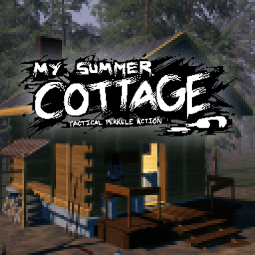

# [My Summer Cottage](https://asset.party/fish/sauna)

This is the submitted version of "My Summer Cottage" for the [first game jam hosted by Facepunch](https://sbox.game/news/game-contest-feb-2024). If you plan on using major parts of this repository please make sure to follow the license. Just note that the codebase contains plenty of disgusting code that was hastily written to ensure we meet the submission deadline. We have continued to work on this title but any future updates will NOT be submitted to this repository.

## Credits

[ceitine](https://github.com/ceitine) - Gameplay Lead, Programmer, Shaders, Finnish Culture Сonsultant

[CyberAgent](https://github.com/CyberAgentz) - Story Lead, Producer, Modeller, Events

[gio](https://github.com/gio3k) - UI Programmer

[Grodbert](https://github.com/Grodbert) - Art Lead, Character Artist, Animator

[Luke](https://github.com/NotGaylien) - Props & Items Artist, Clothing Artist, Particle Artist, Shaders, Events and Npcs

[matek](https://github.com/matekdev) - Systems Programmer, Gameplay Programmer, UI Programmer, Shaders, Sound Design

[rndtrash](https://github.com/rndtrash) - System Programmer, NokLa Sounds, UI Programmer

[ubre](https://github.com/yuberee) - Project Lead, Gameplay Programmer

[wheatleymf](https://github.com/WheatleyMF) - Art Direction, Ambient Artist, Foliage & Prop artist, Mapper, UI Designs, Shaders

## License

If you plan to use large parts of this project please abide by this license. We will find you.

<a property="dct:title" rel="cc:attributionURL" href="https://github.com/Small-Fish-Dev/My-Summer-Cottage">My Summer Cottage</a> by <a rel="cc:attributionURL dct:creator" property="cc:attributionName" href="https://smallfi.sh/">Small Fish</a> is licensed under <a href="http://creativecommons.org/licenses/by-nc-sa/4.0/?ref=chooser-v1" target="_blank" rel="license noopener noreferrer" style="display:inline-block;">CC BY-NC-SA 4.0</a>

